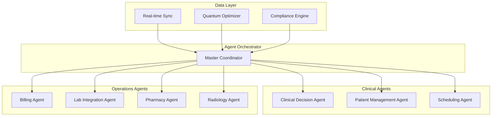

<div align="center">

# HealthAgent - Quantum-Enhanced Multi-Agent Hospital Management

<p><em>7 Autonomous Clinical Agents with Quantum Optimization for Enterprise Hospital Operations</em></p>

<p>
  <a href="#overview"></a>
  <a href="#agent-orchestration-architecture"></a>
  <a href="#key-features"></a>
  <a href="#getting-started"></a>
</p>

<p>
  
  
  
  
  
  
</p>

<br>

<table>
<tr>
<td width="50%">

**Platform Highlights**
- 7 autonomous agents with specialized clinical domain knowledge
- Quantum computing optimization for resource allocation and scheduling
- Full HIPAA compliance for all 50 US states plus Turkish KVKK
- Real-time patient data synchronization via WebSocket across all systems

</td>
<td width="50%">

**Technical Excellence**
- FastAPI Python 3.12 backend with Node.js agent runtime
- Inter-agent communication with dedicated message bus
- Continuous learning from facility-specific historical patterns
- End-to-end encryption for all patient health information

</td>
</tr>
</table>

</div>

---

## Overview

HealthAgent is an enterprise hospital management system powered by 7 autonomous agents. Each agent specializes in a distinct operational domain — from clinical decision support to pharmacy management — with quantum computing optimization for resource allocation and real-time patient data synchronization via WebSocket.

The platform meets full HIPAA compliance for US operations (all 50 states) and KVKK compliance for Turkish healthcare regulations.

## Agent Orchestration Architecture



## The 7 Autonomous Agents

| Agent | Domain | Responsibilities |
|---|---|---|
| Clinical Decision Agent | Clinical Support | Evidence-based recommendations, diagnosis support, treatment protocols |
| Patient Management Agent | Patient Flow | Admissions, discharges, transfers, patient records |
| Scheduling Agent | Operations | Appointment optimization, staff scheduling, OR booking |
| Billing Agent | Finance | Insurance claims, coding, revenue cycle management |
| Lab Integration Agent | Diagnostics | Lab order management, result routing, critical value alerts |
| Pharmacy Agent | Medication | Drug dispensing, interaction checks, formulary management |
| Radiology Agent | Imaging | Study routing, PACS integration, report distribution |

## Key Features

- **7 Autonomous Healthcare Agents** — Independent agents with specialized domain knowledge and inter-agent communication
- **Quantum Computing Optimization** — Resource allocation and scheduling optimization via quantum computing APIs
- **Real-Time Patient Data Sync** — WebSocket-based live synchronization across all hospital systems
- **US + Turkey Native Compliance** — Full support for all 50 US states and Turkish KVKK regulations
- **HIPAA + KVKK Full Compliance** — Audit trails, data minimization, breach notification workflows
- **Continuous Learning** — Agents adapt to facility-specific patterns from historical patient data

## Tech Stack

| Layer | Technology | Badge |
|:------|:-----------|:------|
| Backend Core | Python 3.12, FastAPI |   |
| Agent Runtime | Node.js 20, Socket.io |  |
| Quantum Computing | Quantum Computing APIs |  |
| Real-Time | WebSocket, Socket.io |  |
| Container | Docker, Docker Compose |  |

## Project Structure

```
agent.ailydian.com/
├── agents/               # 7 autonomous agent implementations
│   ├── clinical/         # Clinical decision agent
│   ├── patient/          # Patient management agent
│   ├── scheduling/       # Scheduling optimization agent
│   ├── billing/          # Billing and revenue cycle agent
│   ├── lab/              # Lab integration agent
│   ├── pharmacy/         # Pharmacy management agent
│   └── radiology/        # Radiology workflow agent
├── api/                  # FastAPI REST + WebSocket server
├── core/                 # Agent orchestrator and coordinator
├── quantum-core/         # Quantum optimization modules
├── compliance/           # HIPAA + KVKK compliance engine
├── integrations/         # Hospital system connectors
└── frontend/             # Dashboard and monitoring UI
```

## Getting Started

### Prerequisites

- Python 3.12+
- Node.js 20+
- Docker and Docker Compose
- Quantum computing API credentials (see Environment Variables)

### Installation

```bash
# Clone the repository
git clone https://github.com/lydianai/agent.ailydian.com.git
cd agent.ailydian.com

# Create Python virtual environment
python3 -m venv venv312
source venv312/bin/activate

# Install Python dependencies
pip install -r requirements.txt

# Install Node.js dependencies
npm install

# Configure environment variables
cp .env.example .env

# Start all services
docker compose up -d
```

### Quick Start

```bash
# Run the development server
./START_LOCALHOST.sh

# Or manually
python main.py
```

## Environment Variables

| Variable | Description | Required |
|---|---|---|
| `DATABASE_URL` | PostgreSQL connection string | Yes |
| `REDIS_URL` | Redis connection string | Yes |
| `JWT_SECRET` | JWT signing secret | Yes |
| `QUANTUM_API_KEY` | Quantum computing service API key | Yes |
| `QUANTUM_API_URL` | Quantum computing service endpoint | Yes |
| `HIPAA_AUDIT_LOG_PATH` | Path for HIPAA audit logs | Yes |
| `KVKK_DATA_RESIDENCY` | Data residency region for KVKK | Yes |
| `LLM_PROVIDER_URL` | Language model provider endpoint | Yes |
| `LLM_API_KEY` | Language model provider API key | Yes |

## Compliance

### HIPAA (United States)

- Complete audit trail for all PHI access
- Data encryption at rest (AES-256) and in transit (TLS 1.3)
- Role-based access control with minimum necessary access
- Automatic breach detection and notification workflow
- Business Associate Agreement (BAA) support

### KVKK (Turkey)

- Data processing records (VERBIS registration ready)
- Explicit consent management
- Data subject rights fulfillment (access, deletion, portability)
- Cross-border data transfer controls

## Security

See [SECURITY.md](SECURITY.md) for the vulnerability reporting policy.

- All endpoints protected with JWT authentication
- HIPAA-compliant audit logging for all PHI access
- End-to-end encryption for patient data
- Regular penetration testing
- OWASP Top 10 mitigations applied

## License

Copyright (c) 2024-2026 Lydian (AiLydian). All Rights Reserved.

This is proprietary software. See [LICENSE](LICENSE) for full terms.

---

Built by [AiLydian](https://www.ailydian.com)
