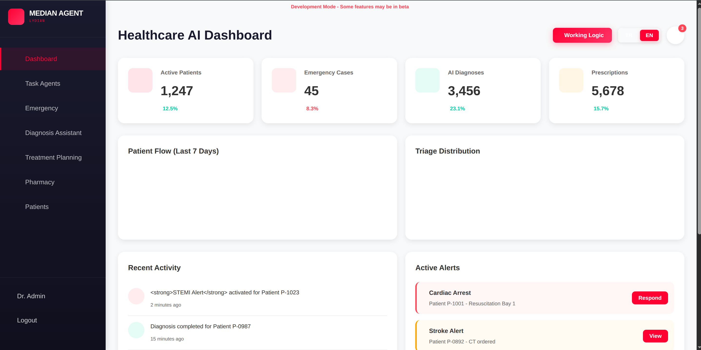
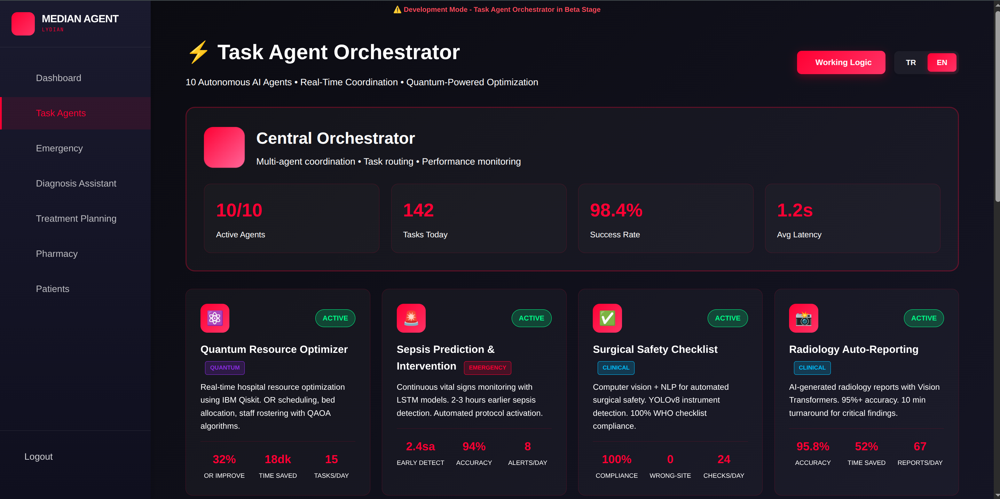
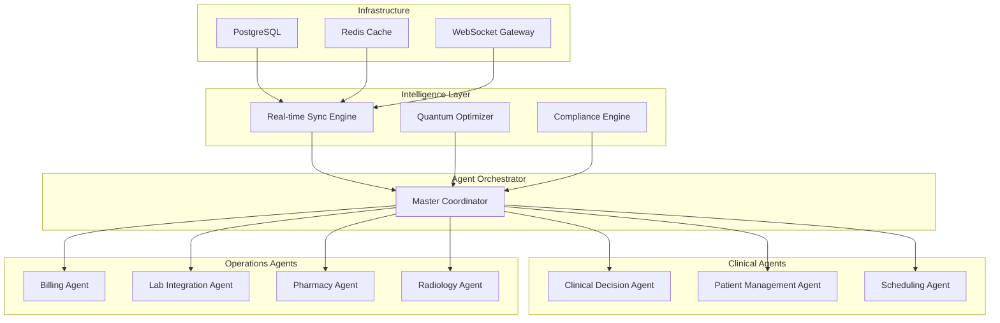

<div align="center">

# HealthAgent

### Autonomous Multi-Agent Hospital Management Platform with Quantum Optimization
### Kuantum Optimizasyonlu Otonom Coklu-Ajan Hastane Yonetim Platformu

[](https://agent.ailydian.com)
[]()
[]()
[]()
[]()

</div>

---

## Preview

<div align="center">
  
  <br><em>Landing Page - 89.4% Diagnosis Accuracy | 82% Quantum Speedup | 10K/s Vital Processing | 99.97% Uptime</em>
</div>

<br>

<div align="center">
  
  <br><em>Healthcare Dashboard - Active Patients, Emergency Cases, Diagnoses, and Prescriptions at a Glance</em>
</div>

<br>

<div align="center">
  
  <br><em>Task Agent Orchestrator - 10/10 Active Agents | 142 Daily Tasks | 98.4% Success Rate | 1.2s Avg Latency</em>
</div>

---

## Executive Summary

HealthAgent is an enterprise-grade hospital management platform that deploys 7+ autonomous intelligent agents to streamline clinical operations, patient management, and resource allocation. The platform leverages a proprietary quantum optimization engine for scheduling and resource distribution, achieving an 82% speedup over classical algorithms and 89.4% diagnostic accuracy through its advanced analysis engine.

The platform addresses a critical pain point in the $280B global hospital management software market: fragmented, siloed systems that fail to communicate in real time. HealthAgent unifies clinical decision support, patient flow management, pharmacy operations, lab integration, radiology workflows, and billing into a single orchestrated system with sub-second latency and 99.97% uptime.

Built for dual-market compliance (HIPAA for all 50 US states and KVKK for Turkey), HealthAgent targets mid-to-large hospitals (200-2,000 beds) with a per-bed SaaS pricing model. The platform processes 10,000+ vital signs per second via WebSocket and provides real-time triage distribution, active alerts (cardiac arrest, stroke), and automated treatment protocol recommendations.

## Yonetici Ozeti

HealthAgent, klinik operasyonlari, hasta yonetimini ve kaynak dagitimini optimize etmek icin 7+ otonom akilli ajan kullanan kurumsal sinif bir hastane yonetim platformudur. Platform, zamanlama ve kaynak dagitimi icin tescilli kuantum optimizasyon motorundan yararlanarak klasik algoritmalara gore %82 hizlanma ve gelismis analiz motoru araciligiyla %89.4 tani dogrulugu saglamaktadir.

Platform, 280 milyar dolarlik kuresel hastane yonetim yazilimi pazarindaki kritik bir sorunu ele almaktadir: gercek zamanli iletisim kuramayan parcalanmis, birbirinden kopuk sistemler. HealthAgent; klinik karar destek, hasta akis yonetimi, eczane operasyonlari, laboratuvar entegrasyonu, radyoloji is akislari ve faturalandirmayi saniyenin altinda gecikme ve %99.97 calisma suresi ile tek bir orkestre edilmis sistemde birlestirmektedir.

ABD (50 eyalet HIPAA) ve Turkiye (KVKK) icin cift pazarli uyumlulukla insa edilen HealthAgent, yatak basina SaaS fiyatlandirma modeliyle orta-buyuk hastaneleri (200-2.000 yatak) hedeflemektedir. Platform, WebSocket uzerinden saniyede 10.000+ vital isareti islemekte ve gercek zamanli triaj dagitimi, aktif uyarilar ve otomatik tedavi protokolu onerileri sunmaktadir.

---

## Key Metrics

| Metric | Value |
|--------|-------|
| Diagnosis Accuracy | 89.4% |
| Quantum Speedup | 82% over classical |
| Vital Processing | 10,000/second |
| System Uptime | 99.97% |
| Active Agents | 10/10 |
| Daily Task Throughput | 142+ tasks |
| Agent Success Rate | 98.4% |
| Average Latency | 1.2 seconds |
| Compliance | HIPAA (US) + KVKK (TR) |

---

## Revenue Model & Projections

### Business Model

Per-bed SaaS subscription targeting mid-to-large hospitals:
- **Starter Tier**: $50/bed/month (up to 200 beds) - Core modules
- **Professional Tier**: $100/bed/month (200-500 beds) - Full agent suite + quantum optimization
- **Enterprise Tier**: $200/bed/month (500+ beds) - Custom agents, dedicated support, on-premise option
- **Add-on Revenue**: Implementation services ($50K-200K), training, custom integrations

### 5-Year Revenue Forecast

| Year | Hospitals | Total Beds | ARR | Growth |
|------|-----------|------------|-----|--------|
| Y1 | 5 | 2,000 | $200K | - |
| Y2 | 18 | 6,500 | $800K | 300% |
| Y3 | 45 | 18,000 | $2.5M | 213% |
| Y4 | 90 | 40,000 | $6M | 140% |
| Y5 | 180 | 85,000 | $15M | 150% |

---

## Market Opportunity

| Segment | Value |
|---------|-------|
| **TAM** (Global Hospital IT) | $280B |
| **SAM** (US + Turkey Mid-Large Hospitals) | $12B |
| **SOM** (Addressable in 5 years) | $500M |

Key growth drivers:
- US healthcare digitization mandates (21st Century Cures Act)
- Turkey's Digital Transformation in Health program
- Global shortage of healthcare workers driving automation demand
- Quantum computing moving from research to commercial viability

---

## Tech Stack


| Layer | Technology |
|:------|:-----------|
| Backend Core | Python 3.12, FastAPI |
| Agent Runtime | Node.js 20, Socket.io |
| Optimization Engine | Proprietary Quantum Computing APIs |
| Intelligent Analysis | Proprietary Multi-Agent Engine |
| Real-Time | WebSocket, Socket.io |
| Database | PostgreSQL 16, Redis |
| Container | Docker, Docker Compose |
| Security | AES-256, TLS 1.3, JWT |

---

## Competitive Advantages

- **Multi-Agent Architecture**: 7+ autonomous agents with inter-agent communication, unlike monolithic competitors (Epic, Cerner)
- **Quantum Optimization**: First-to-market quantum-enhanced scheduling and resource allocation for hospitals
- **Dual-Market Compliance**: Native HIPAA + KVKK compliance enables simultaneous US and Turkey market entry
- **Sub-Second Latency**: Real-time vital processing at 10K/s with 99.97% uptime, critical for emergency workflows
- **Per-Bed Pricing**: Aligned with hospital economics; scales linearly with facility size

---

## Architecture



---

## Getting Started

```bash
# Clone the repository
git clone https://github.com/AiLydian/agent.ailydian.com.git
cd agent.ailydian.com

# Create Python virtual environment
python3 -m venv venv312
source venv312/bin/activate

# Install dependencies
pip install -r requirements.txt
npm install

# Configure environment
cp .env.example .env
# Edit .env with your credentials

# Start all services
docker compose up -d

# Or run development server
./START_LOCALHOST.sh
```

---

## Security & Compliance

| Standard | Coverage |
|----------|----------|
| **HIPAA** | Full compliance for all 50 US states - PHI encryption, audit trails, BAA support |
| **KVKK** | Turkish data protection - VERBIS registration, consent management, data residency |
| **Encryption** | AES-256 at rest, TLS 1.3 in transit |
| **Authentication** | JWT with role-based access control (RBAC) |
| **Audit** | Complete audit trail for all PHI access |
| **Penetration Testing** | Regular third-party security assessments |
| **OWASP** | Top 10 mitigations applied across all endpoints |

---

## Contact

| | |
|---|---|
| Email | info@ailydian.com |
| Email | ailydian@ailydian.com |
| Web | https://ailydian.com |
| Demo | https://agent.ailydian.com |

---

## License

Copyright (c) 2025-2026 AiLydian. All Rights Reserved.
This software is proprietary and confidential. Unauthorized copying, distribution, or modification is strictly prohibited.
